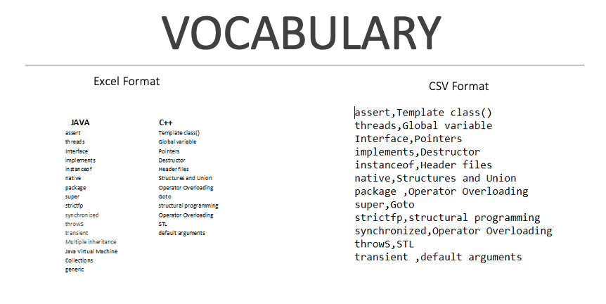
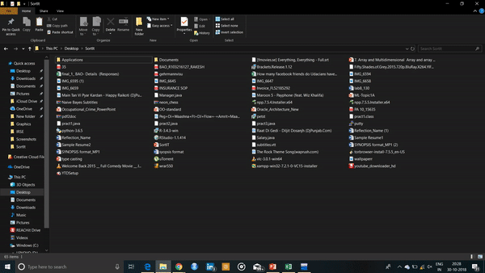
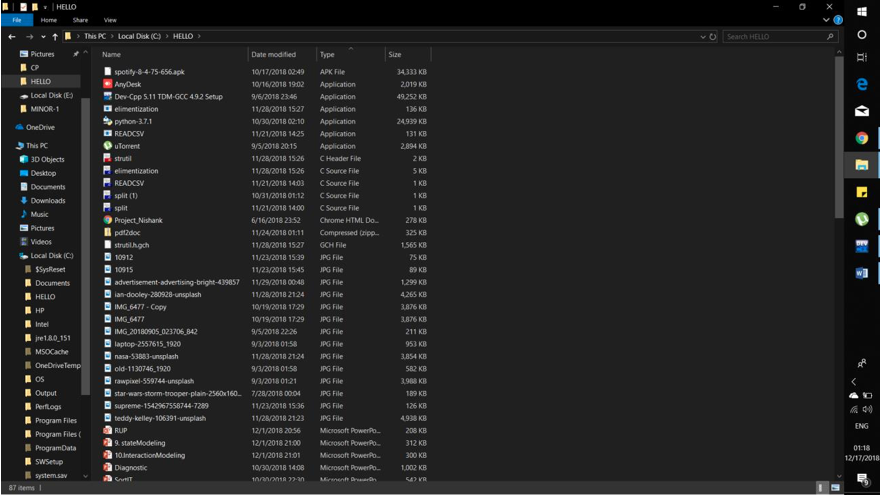
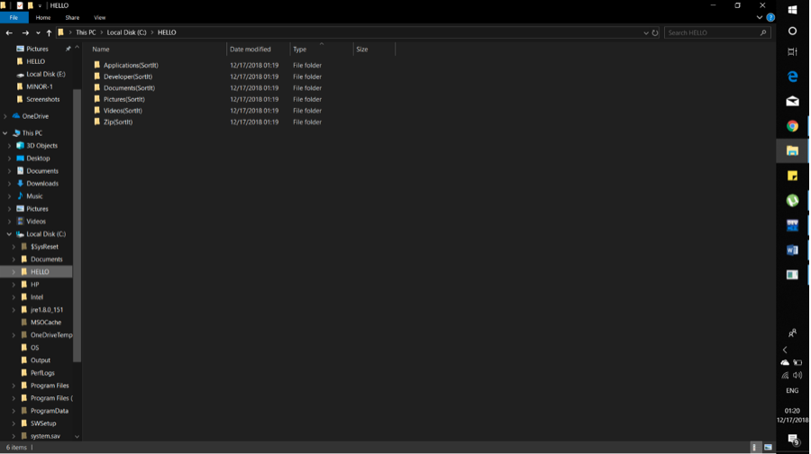
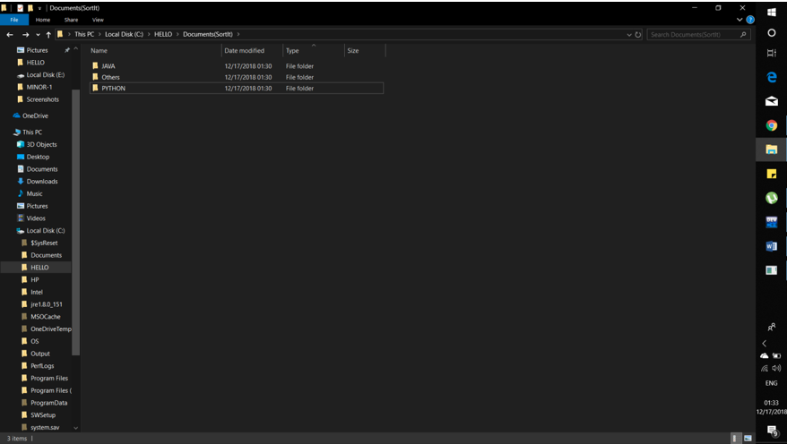
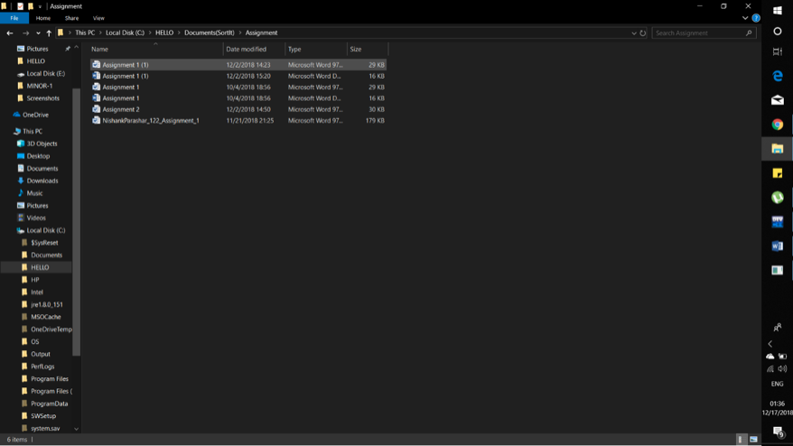

# sortIT-Automated-File-Organization-System
<b><h3>About :</h3></b>
With number of files being used on the system increasing everyday, it becomes almost impossible to organise them. To solve this problem, an automated file organisation system for Windows OS is built, which can declutter system files in just a few seconds by putting them into appropriate folders basis their extension and content of the file. This program is intelligent enough to identify a file by reading its content and matching it with the given dataset.

<b><h3>Objective :</h3></b>
1. Arrange the file into respective folders on the basis of the extension. (Videos, Music, Document, Pictures)
2. Arrange the file into respective folders on the basis of the content. 
3. Arrange the file into respective folder as per the user’s requirement. 

Sample Vocabulary used for content classification : 

<b><h3>Outputs :</h3></b>
sortIT in action : 

Sequence of outputs : 
1. Cluttered Directory :

2. Folders created automatically :

3. Sorted on the basis of Content :

4. Sorted on the basis of Extension :

<b><h3>Copyright :Received a copyright(4537/2019-CO/SW)for the same.</h3></b>

<b><h3>Future Scope :</h3></b>
This program can be integrated as an Operating system feature in Windows or Mac OS and can be extended as an option in drop down menu as ‘Folders by Content’ or ‘Folders by Extension’. By just a click of button the directory will be sorted and arranged automatically in less than a minute. 
